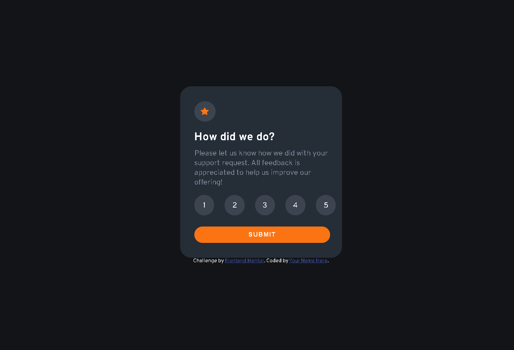
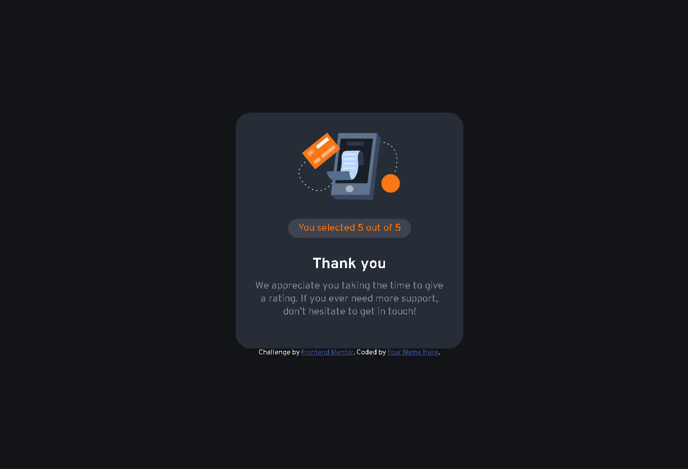

# Frontend Mentor - Interactive rating component solution

This is a solution to the [Interactive rating component challenge on Frontend Mentor](https://www.frontendmentor.io/challenges/interactive-rating-component-koxpeBUmI). Frontend Mentor challenges help you improve your coding skills by building realistic projects. 

## Table of contents

- [Overview](#overview)
  - [The challenge](#the-challenge)
  - [Screenshot](#screenshot)
  - [Links](#links)
- [My process](#my-process)
  - [Built with](#built-with)
  - [What I learned](#what-i-learned)
  - [Continued development](#continued-development)
- [Author](#author)
- [Acknowledgments](#acknowledgments)

## Overview

### The challenge

Flip Animation: It was tricky to get the flip animation to look smooth and ensure the components appeared and disappeared at the right time. I solved this by using setTimeout() to control the timing of when each component is hidden and shown.

Responsive Design: Ensuring that the design looks good on all screen sizes required careful tweaking of CSS media queries.

### Screenshot
Interactive Rating Component Design(Rating state)


Interactive Rating Component Design(Thanky you state)


### Links

- Solution URL: [https://github.com/hoor23/interactive-rating-component-main.git](https://github.com/hoor23/interactive-rating-component-main.git)
- Live Site URL: [ https://hoor23.github.io/interactive-rating-component-main/]( https://hoor23.github.io/interactive-rating-component-main/)

## My process

### Built with

- HTML5: Markup language for the structure of the page.
- CSS3: For layout, animations, and responsiveness.
- JavaScript (ES6): To handle dynamic interactions and animations.
- Google Fonts: The project uses the Overpass font for a modern and clean look.
- Mobile-first workflow

### What I learned

3D Transforms in CSS: This project helped me better understand how to use rotateY for 3D effects.
CSS Transitions and Animations: I deepened my knowledge of how to apply transitions to multiple properties like transform and opacity.
Event Handling in JavaScript: This project helped improve my skills in managing user interactions with JavaScript.
Here are some key features and code snippets that power the project:
The CSS for the flip animation:

```css
.rating-state, .thanku-state {
  transition: transform 0.6s ease-in-out, opacity 0.6s ease-in-out;
  transform-style: preserve-3d;
  backface-visibility: hidden;
}

.flip-out {
  transform: rotateY(180deg);
  opacity: 0;
}

.flip-in {
  transform: rotateY(0deg);
  opacity: 1;
}
```
This code adds a flip effect when transitioning between the rating and the "Thank You" screen:
```js
document.querySelector("button").addEventListener('click', function(){
  rating_state.classList.add('flip-out');
  setTimeout(() => {
    rating_state.classList.add('inactive_state');
    rating_state.classList.remove('flip-out');
    thanku_state.classList.remove('inactive_state');
    thanku_state.classList.add('flip-in');
  }, 600);
});
```
The following code snippet dynamically highlights the hovered rating and the previous ratings:
```js
const rating_number = document.querySelectorAll(".rating_container span");

rating_number.forEach(function (rate) {
  rate.addEventListener("mouseenter", function () {
    rate.classList.add('rating_hover');
    if (rate.previousElementSibling) {
      rate.previousElementSibling.classList.add('previous_ratin_btn');
    }
  });

  rate.addEventListener("mouseleave", function () {
    rate.classList.remove('rating_hover');
    if (rate.previousElementSibling) {
      rate.previousElementSibling.classList.remove('previous_ratin_btn');
    }
  });
});

```

### Continued development

Accessibility: I plan to add more accessibility features, such as keyboard navigation, to improve usability for all users.

Additional Animations: I’m considering adding further animations or visual effects to enhance the user experience even more.

## Author

- Frontend Mentor - [hoor23](https://www.frontendmentor.io/profile/hoor23)


## Acknowledgments

Frontend Mentor: For providing great challenges to improve frontend skills.
MDN Web Docs: For always having detailed explanations and examples of CSS and JavaScript concepts.
